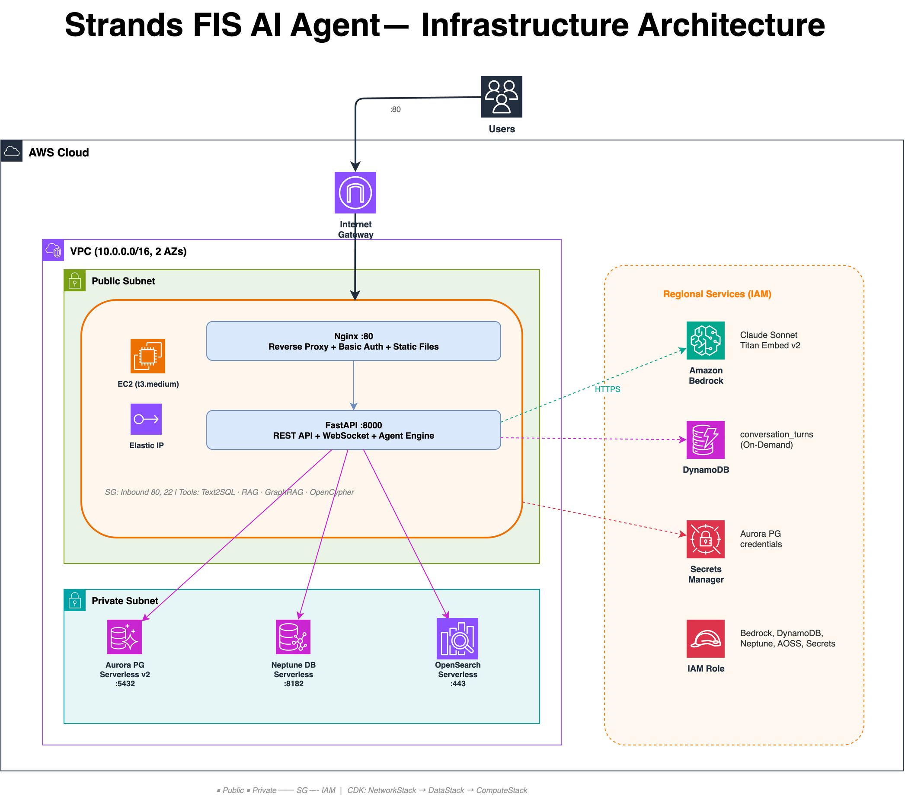
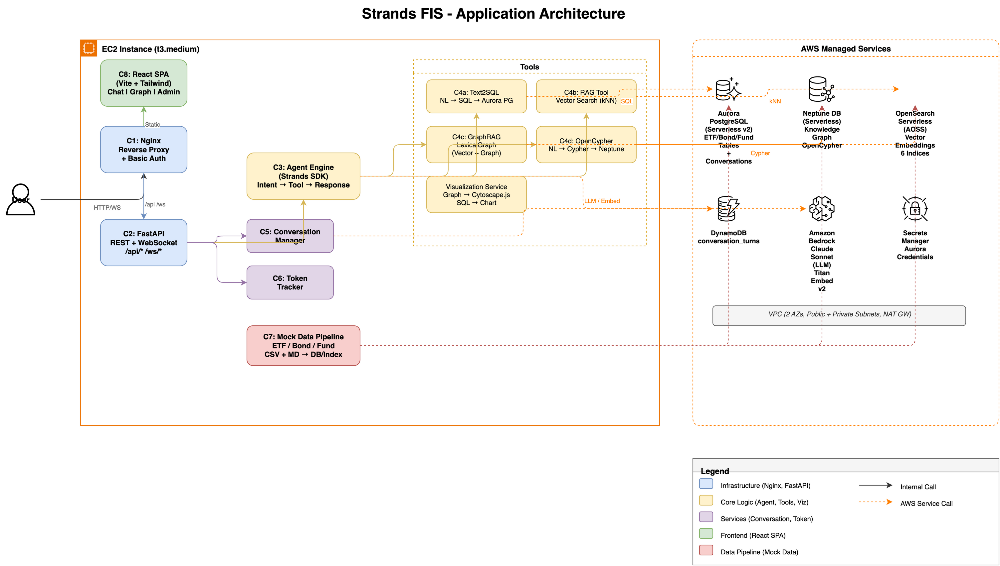

# Strands FIS

AI-powered financial data chatbot with multi-domain support (ETF, Bond, Fund) using 4 data access strategies: Text2SQL, RAG, GraphRAG, and OpenCypher.

## Demo

https://github.com/user-attachments/assets/b520f280-0c0a-409b-a7ec-fb36950dc215

## Architecture

### Infrastructure


### Application


## Key Features

- **Multi-domain Agent** — Strands SDK orchestrator with intent classification (ETF/Bond/Fund) and automatic tool routing
- **4 Data Access Tools** — Text2SQL (Aurora PG), RAG (OpenSearch kNN), GraphRAG (Neptune + OpenSearch), OpenCypher (Neptune)
- **Real-time Streaming** — WebSocket-based token streaming with step-by-step agent process visibility (latency, tokens, cost)
- **Interactive Visualization** — ECharts dynamic charts + Cytoscape.js graph network per domain
- **Conversation Management** — Multi-turn context with DynamoDB persistence and automatic summarization
- **Admin Dashboard** — Token usage/cost tracking, conversation history management

## Tech Stack

| Layer | Technology |
|-------|-----------|
| Agent | Strands Agents SDK + Amazon Bedrock (Claude Sonnet) |
| Embedding | Amazon Bedrock Titan Embed Text v2 (1024d) |
| Backend | Python 3.11, FastAPI, Uvicorn |
| Frontend | React 18, TypeScript, Vite, Tailwind CSS |
| Chart | ECharts |
| Graph Viz | Cytoscape.js (cose-bilkent) |
| RDB | Aurora PostgreSQL Serverless v2 |
| Graph DB | Neptune DB Serverless (OpenCypher) |
| Vector Store | OpenSearch Serverless |
| Conversations | DynamoDB |
| Web Server | Nginx (reverse proxy + Basic Auth) |
| IaC | AWS CDK (TypeScript) |
| Container | Docker + Docker Compose |

## Quick Start

```bash
# 1. Clone
git clone https://github.com/Soyougjeon/strands-fis.git
cd strands-fis

# 2. Configure
cp .env.example .env
# Edit .env with your AWS endpoints

# 3. Run
docker-compose up -d --build

# 4. Verify
curl http://localhost:8000/api/health
# Open http://localhost (Basic Auth required)
```

## Project Structure

```
strands-fis/
├── backend/          # FastAPI + Strands Agent + 4 Tools + Services
├── frontend/         # React SPA (Chat, Graph Network, Admin)
├── pipeline/         # Mock data generators + DB/index loaders
├── infra/            # AWS CDK stacks (Network, Data, Compute)
├── nginx/            # Reverse proxy + Basic Auth config
├── guide/            # 7 handoff documents (see below)
├── img/              # Architecture diagrams
├── Dockerfile        # Backend image
├── Dockerfile.frontend
└── docker-compose.yml
```

## Documentation

Read in this order:

| # | Document | Purpose |
|---|----------|---------|
| 1 | [Architecture Overview](guide/doc1-architecture-overview.md) | System components, data flow, tech stack |
| 2 | [Customization Playbook](guide/doc2-customization-playbook.md) | 10-step checklist to adapt to your domain |
| 3 | [Infrastructure Setup](guide/doc3-infrastructure-setup-guide.md) | CDK stacks, security groups, IAM, env vars |
| 4 | [Data Schema & Indexing](guide/doc4-data-schema-indexing-spec.md) | DB DDL, Neptune graph model, OpenSearch indices, MD format |
| 5 | [Backend API & Agent](guide/doc5-backend-api-agent-spec.md) | 10 REST + 1 WS endpoints, agent loop, tool interfaces, prompts |
| 6 | [Frontend Spec](guide/doc6-frontend-specification.md) | UI wireframes, TypeScript types, business rules |
| 7 | [Deployment Guide](guide/doc7-deployment-guide.md) | Docker, Nginx, deploy steps, troubleshooting |

## Customization

To adapt this system to your own domain (e.g., Insurance, Banking):

1. Define your intents → `backend/agent/prompts.py`
2. Create DB schema → `pipeline/models/`
3. Write data generators → `pipeline/generators/`
4. Update tool mappings → `backend/tools/`
5. Modify frontend tabs → `frontend/src/components/`

See [Doc 2: Customization Playbook](guide/doc2-customization-playbook.md) for the full 10-step guide.

## License

MIT
