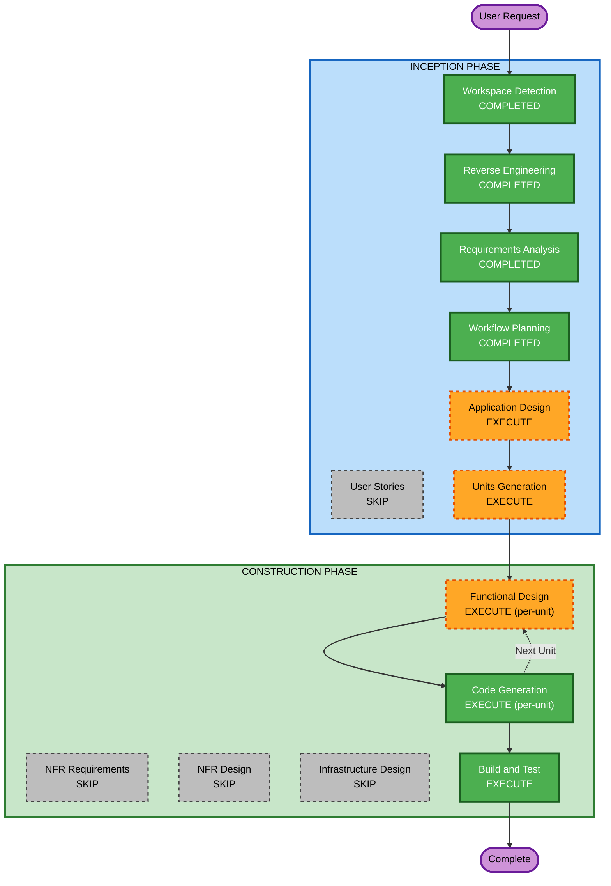

# Execution Plan

## Detailed Analysis Summary

### Transformation Scope
- **Transformation Type**: Architectural - 기존 CLI 파이프라인에 Agent + Web UI 레이어 추가
- **Primary Changes**: Strands Agent 백엔드, React 프론트엔드, Mock 데이터 파이프라인 신규 구축
- **Related Components**: 기존 ORM 모델(models.py), GraphRAG indexer(indexer.py) 참조/재사용

### Change Impact Assessment
- **User-facing changes**: Yes - 새로운 챗봇 Web UI (React + 동적 시각화)
- **Structural changes**: Yes - Orchestrator Agent + 4 Tools + FastAPI + React SPA
- **Data model changes**: Yes - 채권/펀드 신규 스키마, 대화 이력, 토큰 사용량 테이블
- **API changes**: Yes - 10개 REST/WebSocket 엔드포인트 신규
- **NFR impact**: No - PoC 수준, 기존 인프라 활용

### Component Relationships
- **Primary Component**: Strands Agent (Orchestrator + 4 Tools)
- **Infrastructure Components**: EC2, Nginx, 기존 AWS 서비스 (Aurora PG, Neptune, OpenSearch, Bedrock)
- **Shared Components**: 기존 ORM 모델(models.py), GraphRAG indexer(indexer.py), config.py
- **New Components**: FastAPI Backend, React Frontend, Mock Data Pipeline, Admin Dashboard

### Risk Assessment
- **Risk Level**: Medium
- **Rollback Complexity**: Easy - 신규 구축이므로 기존 시스템에 영향 없음
- **Testing Complexity**: Moderate - Agent + 4 Tools + UI 통합 테스트 필요

---

## Workflow Visualization



### Text Alternative
```
INCEPTION:
  [DONE] Workspace Detection -> Reverse Engineering -> Requirements Analysis -> Workflow Planning
  [EXEC] Application Design -> Units Generation
  [SKIP] User Stories

CONSTRUCTION (per-unit loop):
  [EXEC] Functional Design -> Code Generation -> (next unit) -> Build and Test
  [SKIP] NFR Requirements, NFR Design, Infrastructure Design
```

---

## Phases to Execute

### INCEPTION PHASE
- [x] Workspace Detection (COMPLETED)
- [x] Reverse Engineering (COMPLETED)
- [x] Requirements Analysis (COMPLETED)
- [x] User Stories - SKIP
  - **Rationale**: PoC 단계, 단일 사용자 유형 (내부 테스터 5명), 요구사항이 충분히 상세
- [x] Workflow Planning (COMPLETED)
- [ ] Application Design - EXECUTE
  - **Rationale**: 신규 컴포넌트 다수 (Orchestrator Agent, 4 Tools, FastAPI, React, Admin). 컴포넌트 간 관계와 서비스 레이어 설계 필요.
- [ ] Units Generation - EXECUTE
  - **Rationale**: 복수 유닛 분해 필요 (Agent, Backend API, Frontend, Mock Data). 유닛별 순차 개발.

### CONSTRUCTION PHASE (per-unit)
- [ ] Functional Design - EXECUTE
  - **Rationale**: 채권/펀드 신규 DB 스키마, 대화 이력/토큰 사용량 테이블, Agent Tool 비즈니스 로직 상세 설계 필요
- [ ] NFR Requirements - SKIP
  - **Rationale**: PoC 단계, NFR은 Requirements에서 충분히 정의됨 (성능 목표, 배포 환경)
- [ ] NFR Design - SKIP
  - **Rationale**: NFR Requirements 건너뜀에 따라 자동 건너뜀
- [ ] Infrastructure Design - SKIP
  - **Rationale**: EC2 + 기존 AWS 서비스 활용, 인프라 변경 없음. Nginx 설정은 Code Generation에서 처리.
- [ ] Code Generation - EXECUTE (ALWAYS, per-unit)
  - **Rationale**: 모든 유닛의 실제 코드 구현
- [ ] Build and Test - EXECUTE (ALWAYS)
  - **Rationale**: 전체 빌드, 테스트, 배포 가이드

### OPERATIONS PHASE
- [ ] Operations - PLACEHOLDER

---

## Estimated Unit Breakdown (preliminary)

| Unit | 내용 | 의존성 |
|------|------|--------|
| Unit 1: Mock Data | CSV/MD 생성, DB 입력, RAG/GraphRAG 인덱싱 | 없음 (먼저 실행) |
| Unit 2: Agent Backend | Strands Agent, 4 Tools, FastAPI API | Unit 1 (데이터 필요) |
| Unit 3: Frontend | React UI, 차트/그래프 시각화, Admin | Unit 2 (API 필요) |

상세 유닛 정의는 **Units Generation** 단계에서 확정.

---

## Success Criteria
- **Primary Goal**: Strands Agent 기반 금융 데이터 챗봇 PoC 완성
- **Key Deliverables**:
  - Orchestrator Agent (3 Intent x 4 Tool)
  - React 챗봇 UI (2분할 + Graph Network + Admin 탭)
  - Mock 데이터 (ETF/채권/펀드 CSV + MD)
  - Agent 실행 과정 투명성 (단계별 시간/토큰/비용)
- **Quality Gates**:
  - 4가지 Tool 모두 정상 동작
  - 스트리밍 응답 동작
  - 동적 차트/그래프 시각화 렌더링
  - 5명 동시 접속 테스트 통과
