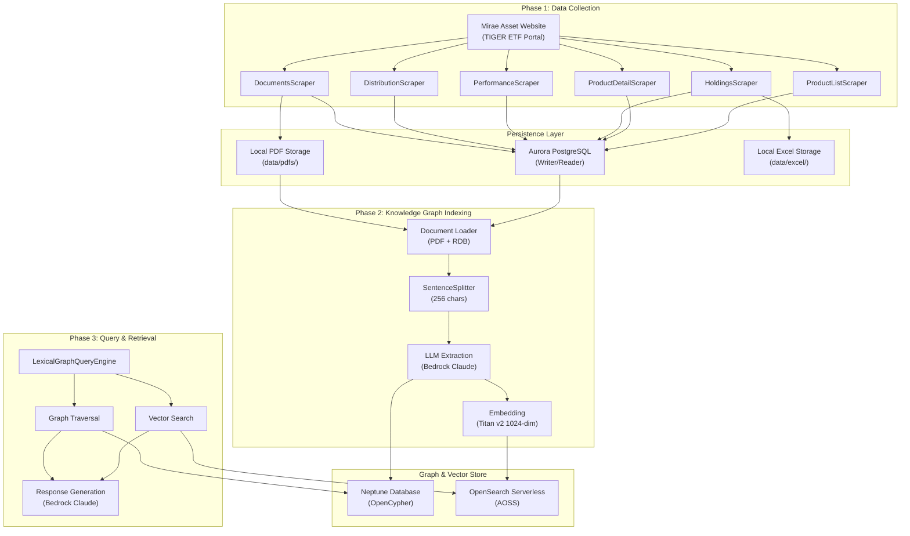
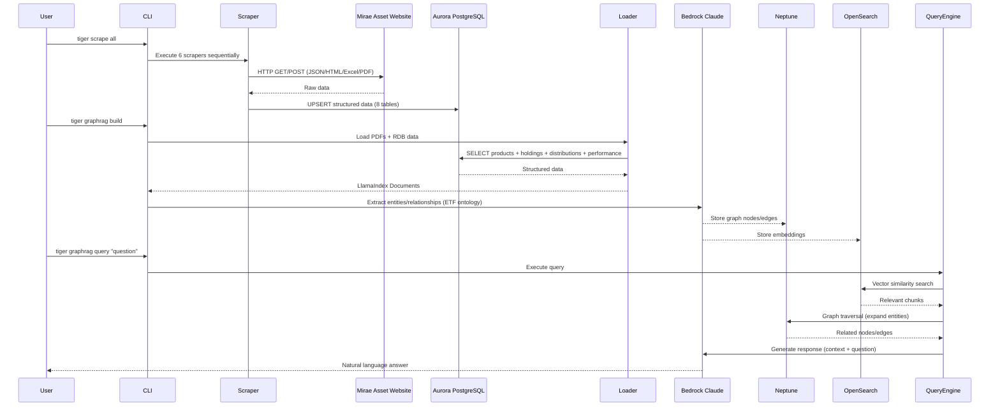

# System Architecture

## System Overview
TIGER ETF Knowledge Graph 시스템은 3단계 파이프라인으로 구성된다:
1. **Data Collection**: 웹 스크래핑으로 ETF 데이터 수집 -> Aurora PostgreSQL 저장
2. **Knowledge Graph Indexing**: RDB + PDF 데이터를 LLM 기반 추출 -> Neptune + OpenSearch 적재
3. **Query & Retrieval**: 자연어 질의 -> 벡터 검색 + 그래프 탐색 -> LLM 응답 생성

## Architecture Diagram



### Text Alternative
```
Phase 1: Data Collection
  Mirae Asset Website -> 6 Scrapers -> Aurora PostgreSQL + Local PDF/Excel

Phase 2: Knowledge Graph Indexing
  Aurora PostgreSQL + PDFs -> Document Loader -> SentenceSplitter
  -> LLM Extraction (Bedrock Claude) -> Neptune DB (Graph)
  -> Embedding (Titan v2) -> OpenSearch (Vectors)

Phase 3: Query & Retrieval
  User Query -> LexicalGraphQueryEngine
  -> Vector Search (OpenSearch) + Graph Traversal (Neptune)
  -> Response Generation (Bedrock Claude) -> Answer
```

## Component Descriptions

### Scrapers Package (src/tiger_etf/scrapers/)
- **Purpose**: 미래에셋 웹사이트에서 TIGER ETF 데이터를 수집
- **Responsibilities**: HTTP 요청, HTML/JSON/Excel 파싱, PDF 다운로드, UPSERT 저장
- **Dependencies**: httpx, beautifulsoup4, xlrd, tenacity, SQLAlchemy
- **Type**: Application

### Parsers Package (src/tiger_etf/parsers/)
- **Purpose**: HTML/Excel 원시 데이터를 구조화된 딕셔너리로 변환
- **Responsibilities**: DOM 파싱, 필드 추출, 타입 변환
- **Dependencies**: beautifulsoup4, lxml
- **Type**: Application (Utility)

### GraphRAG Package (src/tiger_etf/graphrag/)
- **Purpose**: Knowledge Graph 구축, 질의, 실험/평가
- **Responsibilities**: 문서 로딩, LLM 추출, 그래프/벡터 저장, 질의 처리, 실험 관리
- **Dependencies**: graphrag-toolkit, llama-index, boto3, pymupdf
- **Type**: Application

### Database Layer (src/tiger_etf/db.py + models.py)
- **Purpose**: Aurora PostgreSQL 연결 관리 및 ORM 모델 정의
- **Responsibilities**: Writer/Reader 세션 관리, 8개 테이블 ORM 매핑, 스키마 초기화
- **Dependencies**: SQLAlchemy 2.0, psycopg2
- **Type**: Application (Infrastructure)

### CLI Layer (src/tiger_etf/cli.py)
- **Purpose**: 전체 파이프라인의 CLI 인터페이스
- **Responsibilities**: scrape/graphrag/report/experiment 명령 그룹 관리
- **Dependencies**: Click, Rich
- **Type**: Application (Entry Point)

## Data Flow



### Text Alternative
```
1. Scraping Flow:
   User -> CLI (scrape all) -> 6 Scrapers -> Website (HTTP) -> Parse -> UPSERT Aurora PG

2. Indexing Flow:
   User -> CLI (graphrag build) -> Loader (PDF + RDB) -> SentenceSplitter
   -> LLM Extraction -> Neptune (graph) + OpenSearch (vectors)

3. Query Flow:
   User -> CLI (graphrag query) -> Vector Search (OpenSearch)
   + Graph Traversal (Neptune) -> LLM Response -> Answer
```

## Integration Points

### External APIs
- **Mirae Asset TIGER ETF Website** (`https://investments.miraeasset.com/tigeretf`): 상품 목록, 상세, 보유종목, 수익률, 분배금, PDF 문서 수집
- **Amazon Bedrock**: Claude Sonnet (LLM 추출/응답), Titan Embed Text v2 (임베딩 생성)

### Databases
- **Aurora PostgreSQL**: ETF 메타데이터, 보유종목, 수익률, 분배금, 문서 메타데이터, 스크래핑 실행 로그 (Writer/Reader endpoint 분리)
- **Neptune Database**: Knowledge Graph 저장 (Entity, Fact, Topic, Source 노드 + 17가지 관계 타입, OpenCypher)
- **OpenSearch Serverless (AOSS)**: 청크 텍스트 + 1024차원 벡터 임베딩 저장

### Third-party Services
- **AWS Secrets Manager**: Aurora PostgreSQL 비밀번호 관리
- **AWS IAM**: Neptune/OpenSearch 인증

## Infrastructure Components

### AWS Services (Production)
| Service | Purpose | Configuration |
|---------|---------|---------------|
| Aurora PostgreSQL | ETF 구조화 데이터 저장 | Writer/Reader, SSL verify-full |
| Neptune Database | Knowledge Graph | OpenCypher, port 8182 |
| OpenSearch Serverless | Vector embeddings | AOSS collection, VPC endpoint |
| Bedrock | LLM + Embeddings | Claude Sonnet + Titan v2 |
| Secrets Manager | Credential management | Aurora PG password |

### Local Development
- Docker Compose: PostgreSQL 16 (port 5432, user: mirae, db: mirae_etf)
- SSL Certificates: `certs/global-bundle.pem` (RDS root CA)
