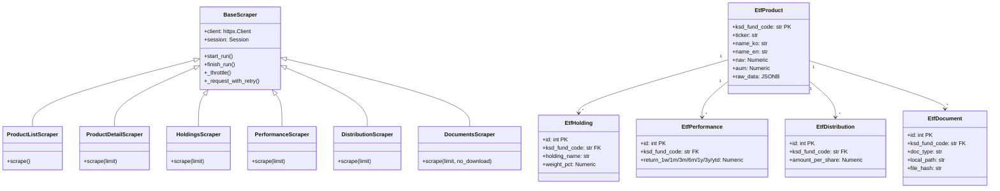

# Code Structure

## Build System
- **Type**: Python (pyproject.toml with setuptools)
- **Package Name**: `tiger-etf`
- **Python Version**: 3.11+
- **Entry Point**: `tiger = tiger_etf.cli:cli` (Click CLI)
- **Configuration**: pyproject.toml (dependencies, build config), config.yaml (runtime settings), .env (secrets)

## Key Classes/Modules



### Text Alternative
```
Scraper Hierarchy:
  BaseScraper (abstract)
    |-- ProductListScraper
    |-- ProductDetailScraper
    |-- HoldingsScraper
    |-- PerformanceScraper
    |-- DistributionScraper
    |-- DocumentsScraper

ORM Models (tiger_etf schema):
  EtfProduct (PK: ksd_fund_code)
    |-- EtfHolding (FK: ksd_fund_code)
    |-- EtfPerformance (FK: ksd_fund_code)
    |-- EtfDistribution (FK: ksd_fund_code)
    |-- EtfDocument (FK: ksd_fund_code)
    |-- EtfDailyPrice (FK: ksd_fund_code)
    |-- ScrapeRun (audit table)
```

## Existing Files Inventory

### Core Files
- `src/tiger_etf/__init__.py` - Package initialization
- `src/tiger_etf/cli.py` - Click CLI entry point (scrape, graphrag, report, experiment commands)
- `src/tiger_etf/config.py` - Pydantic Settings (3-tier config: env > .env > config.yaml)
- `src/tiger_etf/db.py` - SQLAlchemy engine setup (Writer/Reader separation)
- `src/tiger_etf/models.py` - ORM models (8 tables in tiger_etf schema)

### Scrapers
- `src/tiger_etf/scrapers/__init__.py` - Scraper package init
- `src/tiger_etf/scrapers/base.py` - BaseScraper (httpx client, throttle, retry, run tracking)
- `src/tiger_etf/scrapers/product_list.py` - ETF 상품 목록 수집 (JSON API)
- `src/tiger_etf/scrapers/product_detail.py` - ETF 상세 정보 수집 (HTML 파싱)
- `src/tiger_etf/scrapers/holdings.py` - 보유종목 수집 (Excel 다운로드/파싱)
- `src/tiger_etf/scrapers/performance.py` - 수익률 추출 (raw_data에서)
- `src/tiger_etf/scrapers/distribution.py` - 분배금 수집 (HTML 파싱)
- `src/tiger_etf/scrapers/documents.py` - PDF 문서 다운로드 (SHA256 중복 방지)

### Parsers
- `src/tiger_etf/parsers/__init__.py` - Parser package init
- `src/tiger_etf/parsers/detail_parser.py` - 상세 페이지 HTML -> dict
- `src/tiger_etf/parsers/list_parser.py` - 상품 목록 HTML -> list[dict]

### GraphRAG
- `src/tiger_etf/graphrag/__init__.py` - GraphRAG package init
- `src/tiger_etf/graphrag/indexer.py` - LexicalGraph 인덱스 빌더 (ETF 도메인 온톨로지 17 entity + 17 relationship)
- `src/tiger_etf/graphrag/loader.py` - PDF + RDB -> LlamaIndex Documents 로더
- `src/tiger_etf/graphrag/query.py` - LexicalGraphQueryEngine + 그래프 통계
- `src/tiger_etf/graphrag/experiment.py` - 실험 프레임워크 (config 기반 모델 비교)
- `src/tiger_etf/graphrag/evaluator.py` - 평가 프레임워크 (keyword hit, LLM-as-Judge)

### Utilities
- `src/tiger_etf/utils/__init__.py` - Utils package init
- `src/tiger_etf/utils/logging_config.py` - JSON + Rich console 로깅 설정

### Configuration
- `pyproject.toml` - 패키지 메타데이터 + 의존성
- `config.yaml` - 런타임 설정 (scraper, graphrag, 경로)
- `.env.example` - 환경변수 템플릿 (DB URLs, AWS endpoints)
- `alembic.ini` - Alembic 마이그레이션 설정
- `alembic/env.py` - Alembic 환경 설정

### Infrastructure
- `docker/graphrag/docker-compose.yml` - 로컬 개발용 PostgreSQL 16
- `certs/` - RDS SSL 인증서

### Tests
- `tests/__init__.py` - Test package init
- `tests/test_config.py` - Config 설정 테스트
- `tests/test_evaluator.py` - Evaluator 테스트

### Experiments
- `experiments/configs/baseline_claude37_cohere.yaml` - Claude 3.7 + Cohere 베이스라인
- `experiments/configs/exp01_claude45_cohere.yaml` - Claude 4.5 + Cohere
- `experiments/configs/exp02_claude4_cohere.yaml` - Claude 4 + Cohere
- `experiments/configs/exp03_claude37_titan.yaml` - Claude 3.7 + Titan
- `experiments/configs/exp04_haiku45_cohere.yaml` - Haiku 4.5 + Cohere
- `experiments/eval_questions.yaml` - 평가 질문 세트 (40+ questions, 7 categories)

## Design Patterns

### Base Scraper Pattern (Template Method)
- **Location**: `scrapers/base.py`
- **Purpose**: 공통 HTTP 클라이언트, 쓰로틀링, 재시도, 실행 추적 로직 추상화
- **Implementation**: BaseScraper 상속, 각 스크래퍼가 `scrape()` 메서드 구현

### UPSERT Pattern (Idempotent Write)
- **Location**: All scrapers
- **Purpose**: 중복 실행 시 데이터 무결성 보장
- **Implementation**: SQLAlchemy `insert().on_conflict_do_update()` (PostgreSQL dialect)

### Writer/Reader Separation
- **Location**: `db.py`, `config.py`
- **Purpose**: Aurora 읽기/쓰기 엔드포인트 분리로 부하 분산
- **Implementation**: 별도 SQLAlchemy 엔진 + 세션 팩토리

### Pydantic Settings (Multi-Source Config)
- **Location**: `config.py`
- **Purpose**: 환경변수 > .env > config.yaml 우선순위 설정 로딩
- **Implementation**: Pydantic BaseSettings + YamlConfigSettingsSource

### Domain Ontology Pattern
- **Location**: `graphrag/indexer.py`
- **Purpose**: ETF 도메인 특화 Entity/Relationship 추출 가이드
- **Implementation**: 커스텀 프롬프트 + entity_classifications + relationship_types 정의

## Critical Dependencies

### graphrag-toolkit (v3.16.1)
- **Usage**: LexicalGraphIndex, LexicalGraphQueryEngine, GraphStoreFactory, VectorStoreFactory
- **Purpose**: AWS Neptune/OpenSearch 기반 Knowledge Graph 구축 및 질의

### llama-index
- **Usage**: Document, SentenceSplitter, PyMuPDFReader
- **Purpose**: 문서 로딩, 청크 분할, LLM 기반 추출 파이프라인

### SQLAlchemy (2.0+)
- **Usage**: ORM 모델, 엔진/세션 관리, UPSERT
- **Purpose**: Aurora PostgreSQL 데이터베이스 추상화

### httpx (0.27+)
- **Usage**: HTTP 클라이언트 (동기 모드)
- **Purpose**: 웹 스크래핑 HTTP 요청

### boto3 (1.34+)
- **Usage**: Bedrock, Neptune, OpenSearch, Secrets Manager
- **Purpose**: AWS 서비스 SDK
