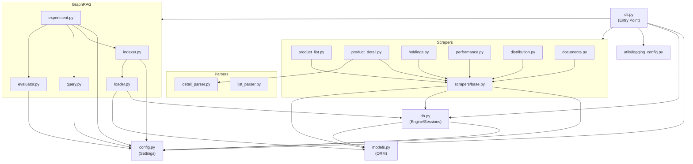

# Dependencies

## Internal Dependencies



### Text Alternative
```
cli.py -> config.py, db.py, logging_config.py, scrapers/*, graphrag/*
scrapers/base.py -> config.py, db.py, models.py
scrapers/* -> base.py
product_detail.py -> detail_parser.py
db.py -> config.py, models.py
graphrag/indexer.py -> config.py, loader.py
graphrag/loader.py -> db.py, models.py
graphrag/query.py -> config.py
graphrag/experiment.py -> config.py, indexer.py, query.py, evaluator.py
graphrag/evaluator.py -> config.py
```

### Key Internal Dependency Chains

#### cli.py depends on All Modules
- **Type**: Runtime
- **Reason**: CLI는 모든 기능의 진입점이므로 전체 모듈 의존

#### scrapers/* depends on base.py, models.py, db.py
- **Type**: Runtime
- **Reason**: 공통 HTTP 클라이언트, ORM 모델, DB 세션 사용

#### graphrag/indexer.py depends on loader.py
- **Type**: Runtime
- **Reason**: 인덱싱 시 문서 로딩 필요

#### graphrag/loader.py depends on db.py, models.py
- **Type**: Runtime
- **Reason**: RDB 데이터를 LlamaIndex Document로 변환

## External Dependencies

### Core Dependencies (pyproject.toml)
| Dependency | Version | Purpose | License |
|-----------|---------|---------|---------|
| httpx | >=0.27 | HTTP 클라이언트 | BSD-3 |
| beautifulsoup4 | >=4.12 | HTML 파싱 | MIT |
| lxml | latest | HTML 파서 백엔드 | BSD |
| xlrd | >=2.0 | XLS 엑셀 파싱 | BSD |
| sqlalchemy | >=2.0 | ORM/DB 추상화 | MIT |
| psycopg2-binary | latest | PostgreSQL 드라이버 | LGPL |
| alembic | >=1.13 | DB 마이그레이션 | MIT |
| pydantic-settings | >=2.0 | 설정 관리 | MIT |
| pyyaml | >=6.0 | YAML 파싱 | MIT |
| click | >=8.1 | CLI 프레임워크 | BSD-3 |
| rich | >=13.0 | 콘솔 포매팅 | MIT |
| tenacity | >=8.2 | 재시도 로직 | Apache-2.0 |
| boto3 | >=1.34 | AWS SDK | Apache-2.0 |

### AI/ML Dependencies
| Dependency | Version | Purpose | License |
|-----------|---------|---------|---------|
| graphrag-toolkit | 3.16.1 | GraphRAG 프레임워크 | Apache-2.0 |
| llama-index | latest | LLM 파이프라인 | MIT |
| pymupdf | >=1.24 | PDF 텍스트 추출 | AGPL-3.0 |

### AWS Service Dependencies
| Service | Authentication | Purpose |
|---------|---------------|---------|
| Amazon Bedrock | IAM | LLM + Embeddings |
| Neptune Database | IAM | Graph Store |
| OpenSearch Serverless | IAM + Data Access Policy | Vector Store |
| Aurora PostgreSQL | Password (Secrets Manager) | RDB |
| Secrets Manager | IAM | Credential Management |
