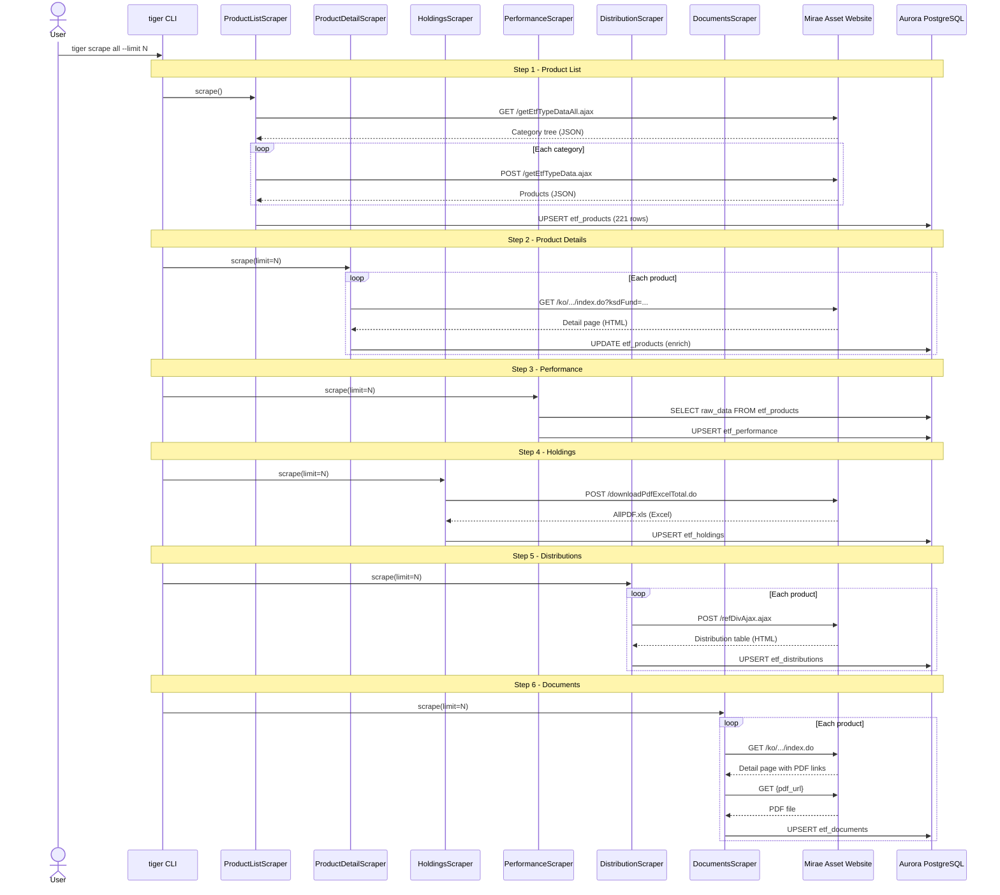
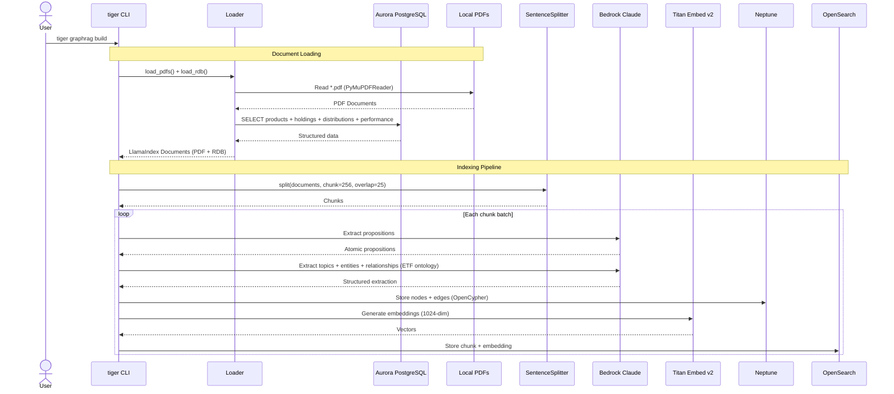
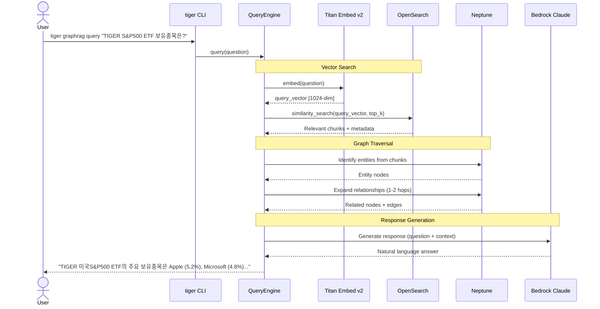
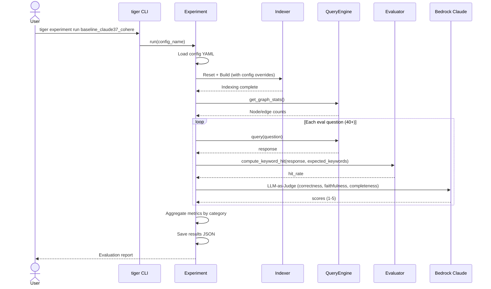

# Interaction Diagrams

## Business Transaction 1: ETF Data Collection (scrape all)



### Text Alternative
```
1. User -> CLI: scrape all
2. ProductListScraper -> Website: GET categories + products -> PG: UPSERT etf_products
3. ProductDetailScraper -> Website: GET detail pages -> PG: UPDATE etf_products
4. PerformanceScraper -> PG: SELECT raw_data -> PG: UPSERT etf_performance
5. HoldingsScraper -> Website: POST download Excel -> PG: UPSERT etf_holdings
6. DistributionScraper -> Website: POST distribution history -> PG: UPSERT etf_distributions
7. DocumentsScraper -> Website: GET PDFs -> PG: UPSERT etf_documents
```

## Business Transaction 2: Knowledge Graph Indexing (graphrag build)



### Text Alternative
```
1. User -> CLI: graphrag build
2. Loader reads PDFs (PyMuPDFReader) + queries RDB (products, holdings, etc.)
3. SentenceSplitter: 256 char chunks with 25 overlap
4. For each chunk:
   a. Bedrock Claude: proposition extraction
   b. Bedrock Claude: topic/entity/relationship extraction (ETF ontology)
   c. Neptune: store graph nodes and edges
   d. Titan Embed v2: generate 1024-dim embeddings
   e. OpenSearch: store chunks with embeddings
```

## Business Transaction 3: Natural Language Query (graphrag query)



### Text Alternative
```
1. User -> CLI: graphrag query "question"
2. Embed question with Titan v2 -> 1024-dim vector
3. OpenSearch: similarity search -> top-k relevant chunks
4. Neptune: identify entities from chunks -> expand 1-2 hops
5. Bedrock Claude: generate response from (question + vector chunks + graph context)
6. Return natural language answer to user
```

## Business Transaction 4: Experiment & Evaluation (experiment run)



### Text Alternative
```
1. User -> CLI: experiment run {config_name}
2. Load YAML config, override GraphRAG settings (LLM, embedding, workers)
3. Reset stores + build index
4. Collect graph statistics
5. For each eval question:
   a. Execute query -> response
   b. Compute keyword hit rate
   c. LLM-as-Judge scoring (correctness, faithfulness, completeness)
6. Aggregate by category, save results JSON
7. Display evaluation report
```
